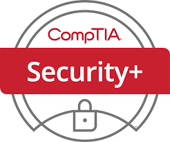
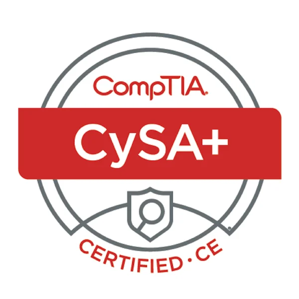
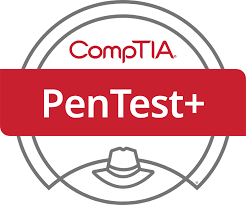

<a href="https://github.com/LorranDias" target="_blank">

</a>

<div align="center">
<a href="https://git.io/typing-svg">

</a>
</div>


<h1 align="center">🛡️ Welcome to my GitHub!</h1>

<p align="center">
I'm Lorran, also known as <strong>Hypno0</strong> — Cybersecurity Analyst, operating as Purple Team.<br>
Breaking in to understand how to defend. Defending to know where to attack.
</p>


## 🔐 Cybersecurity Analyst

🔴 **Red Team Operator** — phishing campaigns, vishing, internal & external pentests.

🔵 **SOC Analyst (Blue Team)** — threat detection, log analysis, incident response and threat hunting.

🟣 **Purple Team mindset** — bridging offense and defense to build stronger security postures.

🚩 **CTF Player** — sharpening offensive skills on the field.


## 🖥️ Current Focus

```bash
$ whoami
hypn0 — cybersecurity analyst | purple team operator

$ cat current_ops.txt
🔴 Running : internal pentest & phishing campaigns
🔵 Hunting : threat actors via SIEM & EDR telemetry
🟣 Building : purple team playbooks & custom tooling
```


## 🛠️ Tech Stack & Tools

<table align="center">
  <tr>
    <td align="center" width="80"><br><sub>Kali Linux</sub></td>
    <td align="center" width="80"><br><sub>Linux</sub></td>
    <td align="center" width="80"><br><sub>Google SecOps</sub></td>
    <td align="center" width="80"><br><sub>Wireshark</sub></td>
    <td align="center" width="80"><br><sub>Burp Suite</sub></td>
    <td align="center" width="80"><br><sub>OpenVAS</sub></td>
    <td align="center" width="80"><br><sub>Nmap</sub></td>
    <td align="center" width="80"><br><sub>Metasploit</sub></td>
  </tr>
  <tr>
    <td align="center" width="80"><br><sub>Python</sub></td>
    <td align="center" width="80"><br><sub>JavaScript</sub></td>
    <td align="center" width="80"><br><sub>Zabbix</sub></td>
    <td align="center" width="80"><br><sub>Grafana</sub></td>
    <td align="center" width="80"><br><sub>YARA</sub></td>
    <td align="center" width="80"><br><sub>Volatility</sub></td>
    <td align="center" width="80"><br><sub>Elastic</sub></td>
    <td align="center" width="80"><br><sub>Velociraptor</sub></td>
  </tr>
</table>


## ⚡ Key Skills

| 🔴 Red Team Ops | Phishing, vishing, internal pentests, social engineering |
|---|---|
| 🔵 SOC / Blue Team | Threat detection, incident response, threat hunting |
| 🟣 Vulnerability Management | OpenVAS, Vulnerability Manager Plus, risk prioritization |
| 🌐 Network Security | Wireshark, Nmap, packet analysis, IDS/IPS |
| 💻 Scripting & Dev | Python, C++, Assembly, JavaScript for tooling and automation |
| 📊 Monitoring | SIEM, EDR, XDR |


## 🏆 Certifications & Badges

| | | |
|:--:|:--:|:--:|
| <p align="center"><br><strong>CSA<br>EC-Council</strong></p> | <p align="center"><br><strong>ECIH<br>EC-Council</strong></p> | <p align="center"><br><strong>Security+<br>CompTIA</strong></p> |


## 🔜 Upcoming Certifications

| | | |
|:--:|:--:|:--:|
| <p align="center"><br><strong>CySA+<br>CompTIA</strong><br></p> | <p align="center"><br><strong>Pentest+<br>CompTIA</strong><br></p> | <p align="center"><br><strong>Google Prof.<br>Security Ops<br>Engineer</strong><br></p> |


## 🐍 Contribution Snake

<div align="center">
  
</div>


<div align="center">

  > *"The quieter you become, the more you are able to hear."* — Kali Linux motto
> 
</div>
  </tr>
  </tr>
</strong>
