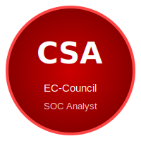
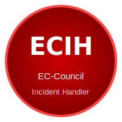
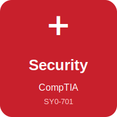
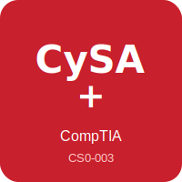
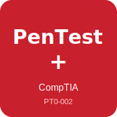

<h1 align="center">🛡️ Welcome to my GitHub!</h1>

I'm <strong>Lorran Ferreira Dias</strong>, passionate about <strong>cybersecurity</strong>. 
Analyzing threats, hunting vulnerabilities, and building a safer digital world — one packet at a time.

  
  &nbsp;
  
  &nbsp;
  

## 🔐 Cybersecurity Analyst & Threat Hunter

🛡️ Focused on **Defensive & Offensive Security** — threat detection, incident response, and vulnerability analysis.

🔍 Skilled in **SIEM, log analysis, network monitoring** and proactive threat hunting.

🚩 **CTF Player** — solving challenges and sharpening skills on TryHackMe and HackTheBox.

⚙️ Constantly studying **malware behavior, attack techniques (MITRE ATT&CK)** and defense strategies.

## 🛠️ Tech Stack & Tools

<table align="center">
<tr>
  <td align="center" width="80"> Kali Linux</td>
  <td align="center" width="80"> Wireshark</td>
  <td align="center" width="80"> Nmap</td>
  <td align="center" width="80"> Burp Suite</td>
  <td align="center" width="80"> Metasploit</td>
  <td align="center" width="80"> Python</td>
  <td align="center" width="80"> Bash</td>
  <td align="center" width="80"> Linux</td>
  <td align="center" width="80"> Splunk</td>
</tr>
</table>

## ⚡ Key Skills

| 🌐 Network Security | Packet analysis, firewall rules, IDS/IPS monitoring |
|---|---|
| 🔎 Threat Hunting | Log analysis, anomaly detection, SIEM (Splunk/ELK) |
| 🧪 Vulnerability Analysis | Scanning, enumeration, PoC testing |
| 🛡️ Incident Response | Triage, containment, forensic investigation |
| 🔐 Web Security | OWASP Top 10, XSS, SQLi, auth flaws |
| 🐚 Scripting | Python & Bash for automation and tooling |

## 🏆 Certifications & Badges

<table align="center">
<tr>
  <td align="center" width="160">
     
    <strong>CSA EC-Council</strong>
  </td>
  <td align="center" width="160">
     
    <strong>ECIH EC-Council</strong>
  </td>
  <td align="center" width="160">
     
    <strong>Security+ CompTIA</strong>
  </td>
</tr>
</table>

## 🔜 Upcoming Certifications

<table align="center">
<tr>
  <td align="center" width="160">
     
    <strong>CySA+ CompTIA</strong> 
    
  </td>
  <td align="center" width="160">
     
    <strong>Pentest+ CompTIA</strong> 
    
  </td>
  <td align="center" width="160">
     
    <strong>Google Prof. Security Ops Engineer</strong> 
    
  </td>
</tr>
</table>

## 📈 GitHub Stats

## 🐍 Contribution Snake

> *"The quieter you become, the more you are able to hear."* — Kali Linux motto

